# Gushwork Assignment — Mangalam HDPE Pipes

A responsive, single-page marketing site for **Mangalam HDPE Pipes**, built with **vanilla HTML, CSS, and JavaScript** (no frameworks). Typography uses [**Inter**](https://fonts.google.com/specimen/Inter) via Google Fonts.

**Repository:** [github.com/skr-c0der/Gushwork-Assignment](https://github.com/skr-c0der/Gushwork-Assignment)

## Run locally

Open `index.html` in a browser, or serve the folder:

```bash
# Python 3
python3 -m http.server 8080

# Node (npx)
npx serve .
```

Then visit `http://localhost:8080` (port may vary).

## Features

- Sticky header with navigation, products dropdown, and **Contact Us** CTA  
- **Product hero:** breadcrumbs, BIS / ISO / CE certification pills, gallery with prev/next, thumbnails, hover zoom preview (desktop)  
- **Technical specifications** table (dark theme)  
- **Features** grid with custom icons (`package`, `needle`, `gear` assets)  
- **FAQ** accordion + catalogue email capture  
- **Applications** horizontal carousel  
- **Manufacturing process** tabbed content  
- **Testimonials** carousel  
- **Portfolio** cards + “Talk to an Expert” CTA (phone icon)  
- **Resources & Downloads** list  
- **Contact** strip with form and quote modal triggers  
- Modals: technical datasheet / quote request  

---

## Website screenshots

Below are captures of the implemented UI (design reference aligned with the Figma brief).

### Product hero

Certification badges, title, feature list, pricing card, gallery, and actions.

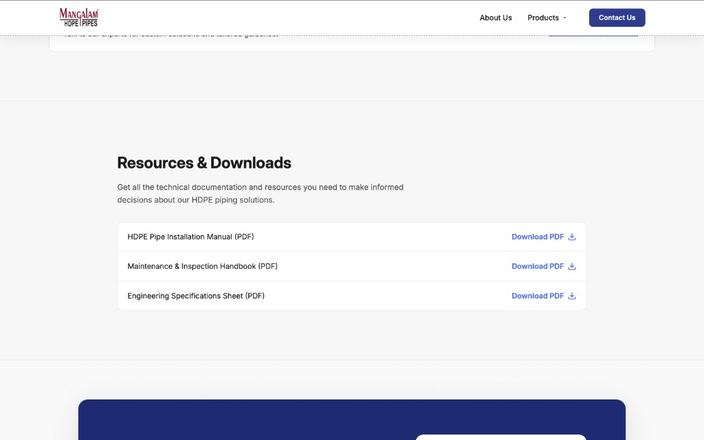

### Trust bar & technical specifications

Partner logos strip and **Technical Specifications at a Glance** table.

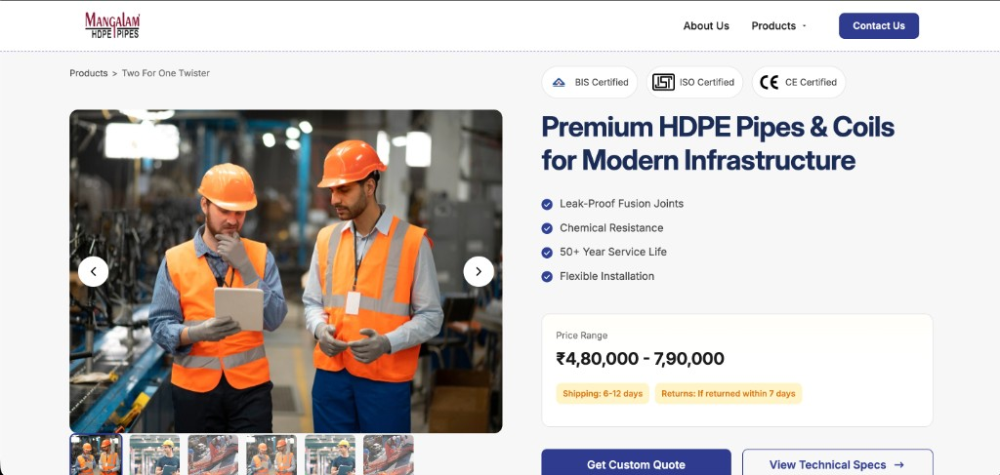

### Features — “Built to Last. Engineered to Perform.”

Six feature cards with icons and **Request a Quote** CTA.

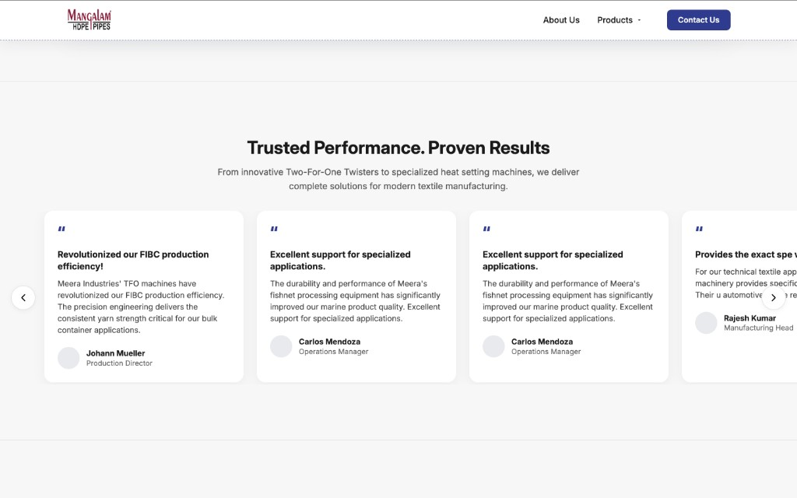

### FAQ & catalogue

Accordion FAQ and email field to request the full catalogue.

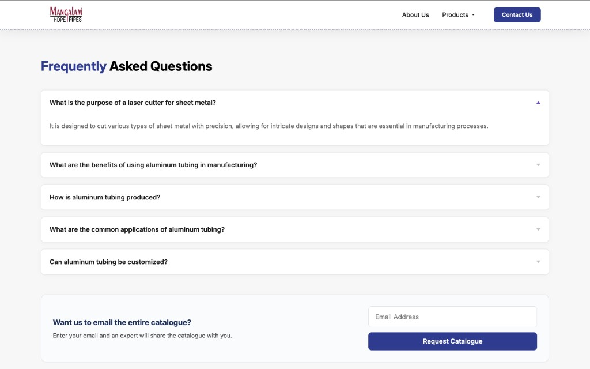

### Versatile applications

Industry cards in a horizontal carousel.

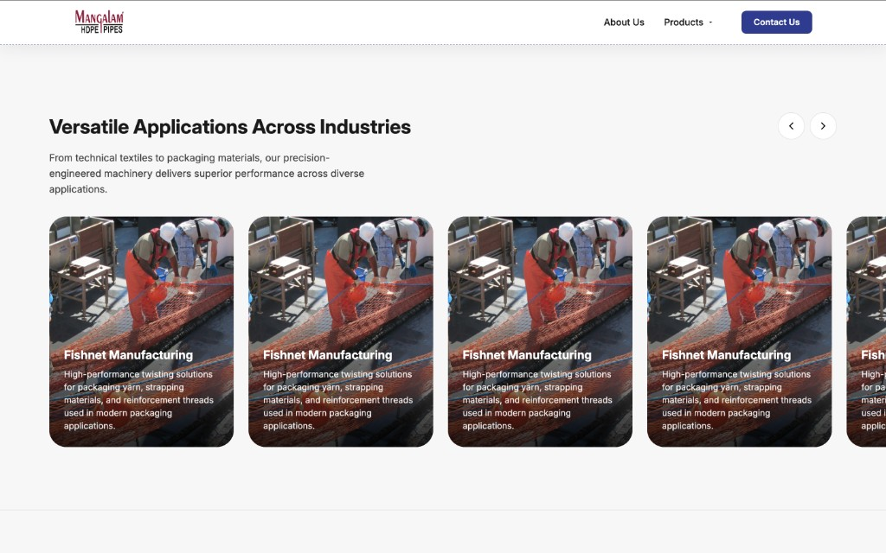

### Manufacturing process

Tabbed **Advanced HDPE Pipe Manufacturing Process** content.

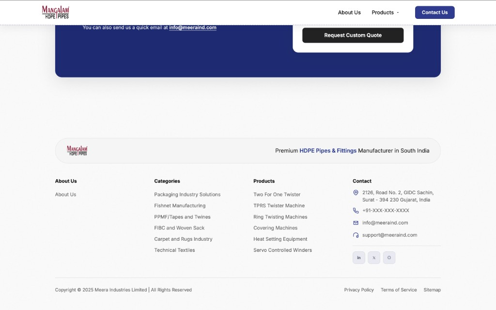

### Testimonials

**Trusted Performance. Proven Results** testimonial cards with navigation.

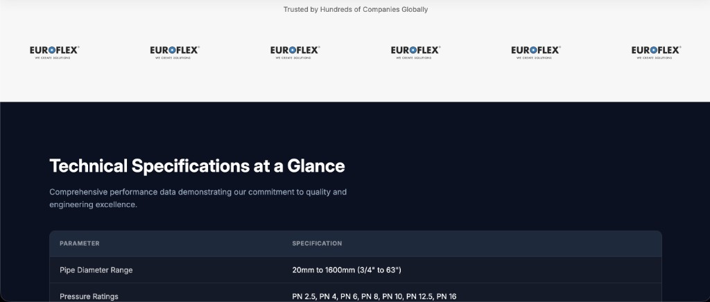

### Portfolio

**Complete Piping Solutions Portfolio** cards and expert CTA banner.

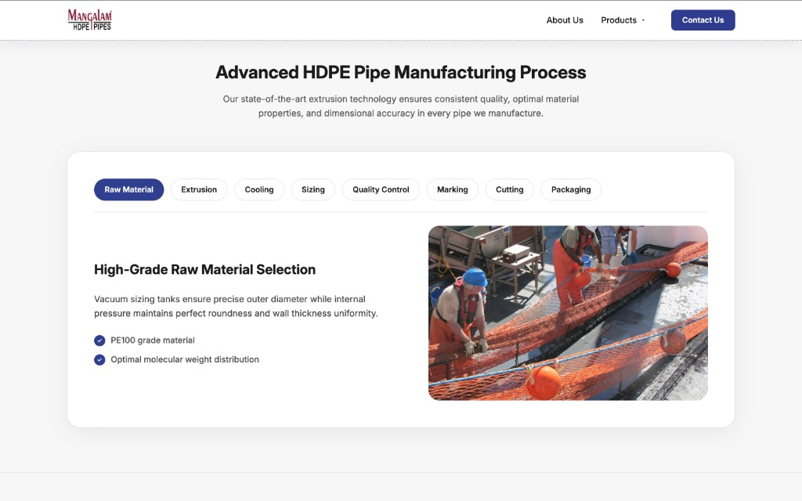

### Resources & downloads

PDF download rows with icons.

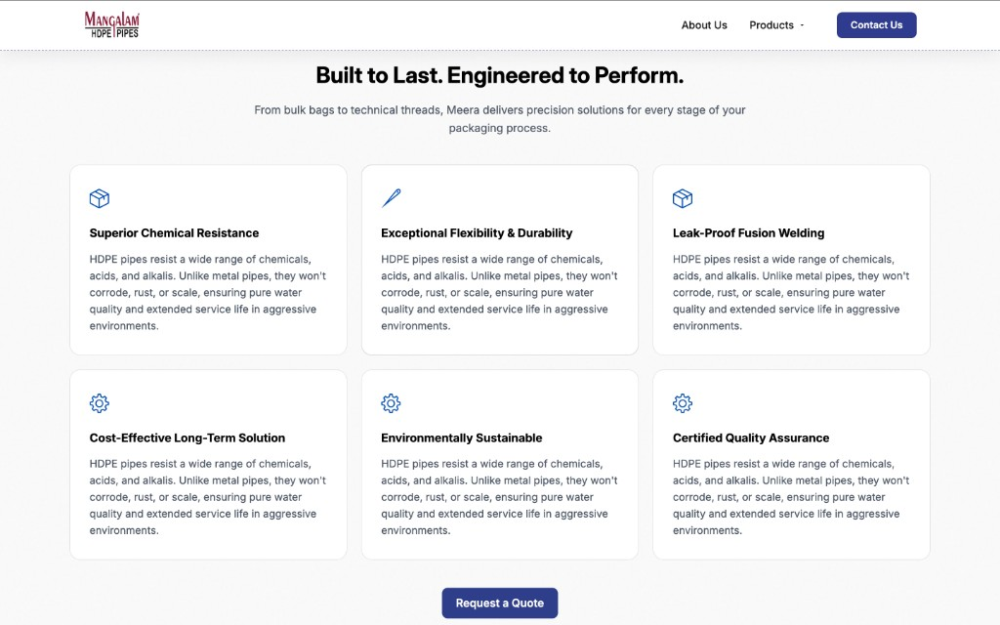

### Contact CTA

Dark band with headline, copy, and **Contact Us Today** form.

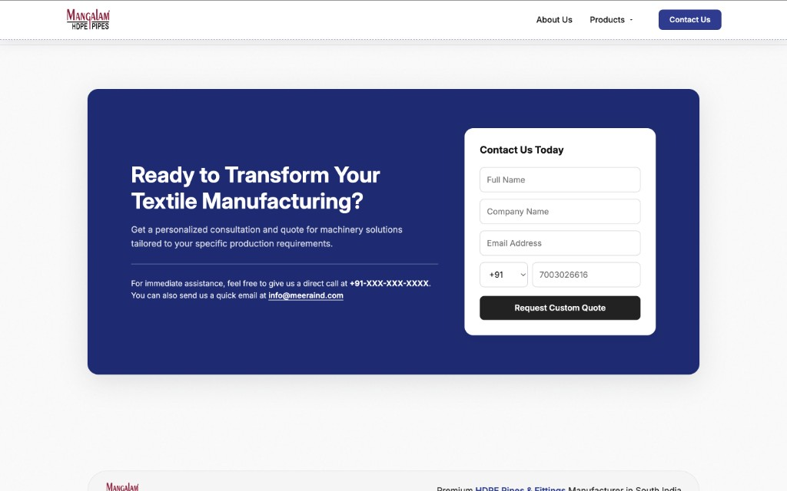

### Footer

Brand strip, link columns, contact details, and legal links.

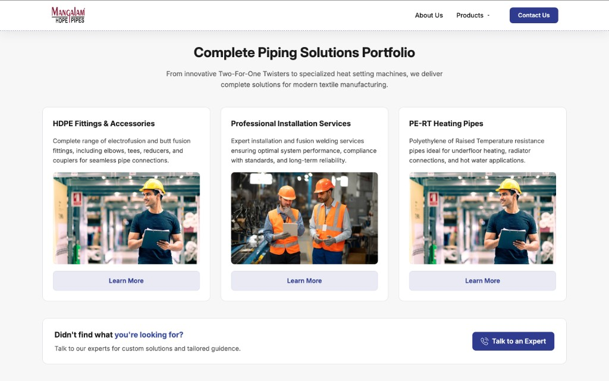

---

## Project structure

| Path | Description |
|------|-------------|
| `index.html` | Page markup and section structure |
| `styles.css` | Layout, components, responsive breakpoints |
| `script.js` | Gallery, modals, carousels, FAQ, header |
| `assets/` | Images, icons, and raster logos used in the UI |
| `docs/screenshots/` | README preview images |

## Tech stack

- HTML5  
- CSS3 (Grid, Flexbox, custom properties)  
- ES5/ES6 JavaScript (no build step)  

---

*Assignment for Gushwork — Mangalam HDPE Pipes product experience.*
